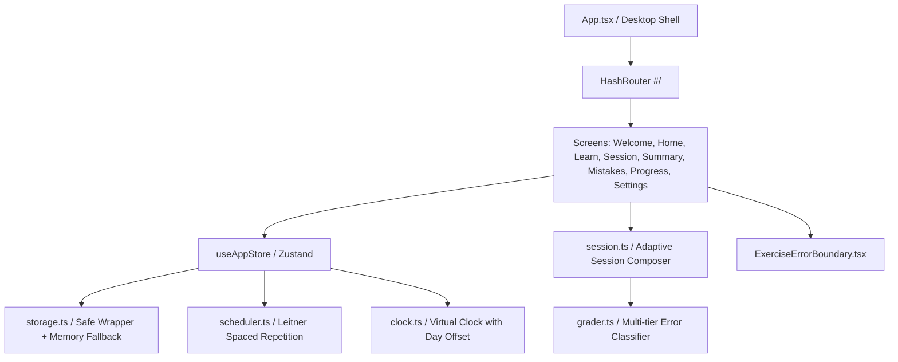
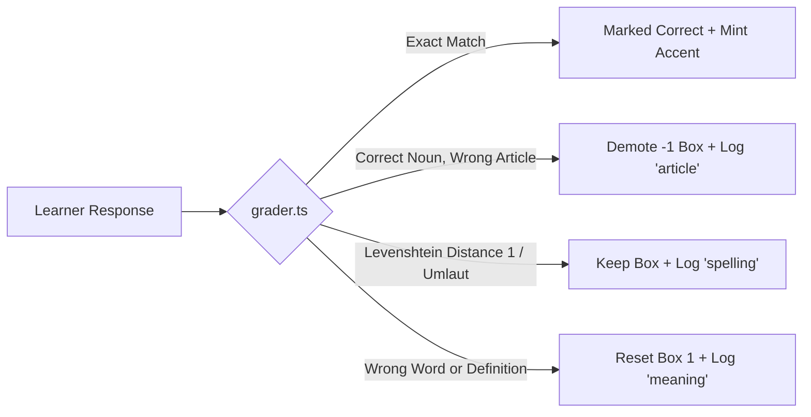

# Project Report: Station Deutsch

> **Medical German Vocabulary Practice for Indian Nurses (A1 / A2)**  
> **Repository:** [https://github.com/Akshay-2441505/Station_Deutsch](https://github.com/Akshay-2441505/Station_Deutsch)  
> **Status:** V2 Complete · 108/108 Tests Passing · Production Build Verified  
> **Date:** October 2026

---

## 1. Executive Summary

**Station Deutsch** is an interactive, mobile-first web application engineered specifically for Indian nurses preparing to work in German hospitals and care facilities.

### The Problem
Skillcase and nursing training institutes teach healthcare German through structured live classes. However, nurses face a steep retention drop-off between lessons. Learning complex medical compound nouns, unpredictable noun genders (*der*, *die*, *das*), and ward interactions requires frequent, low-friction spaced retrieval. Traditional general-purpose apps (like Duolingo) focus on tourist phrases (*"The cat drinks milk"*), while dense textbooks are impractical during 5–10 minute hospital shift breaks.

### The Solution
Station Deutsch acts as a between-class practice companion:
- **Zero sign-up friction**: Learners immediately begin studying without accounts or passwords.
- **Micro-sessions**: Standard sessions are fixed at 10 items (completable in under 3 minutes).
- **Spaced Repetition Engine**: Implements a 5-box Leitner system with strict daily promotion limits and stubborn-word demotion rules.
- **Clinically Rooted**: Vocabulary is restricted to elementary (A1/A2) clinical domains: bedside care, organs, symptoms, ward equipment, and patient admissions.
- **Transparent Mistakes Ledger**: Every slip is recorded with given vs. expected answers, relative timestamps, and dedicated remediation drills.

```
Quick Check (or Manual Choice) ──► Topic Map (Home) ──► Learn Batch (5–8 words)
               ▲                            │                     │
               │                            ▼                     ▼
      Simulate Tomorrow              Practise Session (10 items) ◄┘
         (Virtual Clock)                    │
               ▲                            ▼
               │                     Instant Feedback + Retry Queue
               │                            │
               └──────── Session Summary ◄──┘
                    (Accuracy Trend + Next Review)
```

---

## 2. Software Architecture & Technology Stack

The application was built adhering strictly to the tech stack constraints: **Vanilla CSS design tokens, React 18, TypeScript, and Vite**, with no heavy CSS frameworks.



### Core Technologies
| Component | Technology | Rationale |
|---|---|---|
| **Runtime & Bundler** | Vite 6 + React 18 | Instant HMR, minimal production bundle size (77 kB gzip). |
| **Language** | TypeScript (Strict mode) | Complete type safety across scheduler models, exercise variants, and attempts. |
| **Styling** | Vanilla CSS (`index.css`) | Maximum control over responsive typography, CSS Grid, and custom animations. Zero Tailwind overhead. |
| **State Management** | Zustand 5 with custom persistence | Lightweight, predictable state management with versioned schema migrations (`station-deutsch:v2`). |
| **Routing** | React Router 6 (`HashRouter`) | Hash-based navigation (`#/`) ensures reliable client-side routing on any static host (Vercel, GitHub Pages) without server rewrite issues. |
| **Typography** | `@fontsource-variable/fraunces` & `figtree` | Self-hosted Google Fonts: Fraunces (editorial serif for German prompts and score numerals) and Figtree (clean sans-serif for UI and English glosses). |
| **Icons** | `lucide-react` | Lightweight, accessible SVG icons. |

### Desktop Presentation Architecture ($\ge 1024$px)
While designed mobile-first for Android screens ($390$px base width), desktop visitors see a dedicated two-column presentation layout:
- **Left Column**: Text wordmark, honest product description, a 3-step evaluator guide, and prototype metadata.
- **Right Column**: An authentic $390 \times \min(820\text{px}, 100\text{dvh} - 48\text{px})$ device frame with rounded corners, subtle elevation, and hidden inner scrollbars (`scrollbar-width: none`).

---

## 3. Spaced Repetition & Pedagogical Rules

The learning engine is implemented as pure, deterministic TypeScript functions in `src/lib/scheduler.ts` and `src/lib/grader.ts`:

### 3.1 Leitner 5-Box Interval Schedule
| Box | State Label | Interval | Criteria to Reach |
|---|---|---|---|
| **Box 0** | New | Immediate | Initial unpracticed state. |
| **Box 1** | Learning | Immediate | First checked answer moves word here regardless of score. |
| **Box 2** | Familiar | 1 day | 1 correct answer on a subsequent calendar day. |
| **Box 3** | Familiar | 3 days | Correct answer when due from Box 2. |
| **Box 4** | Strong | 7 days | Correct answer when due from Box 3. |
| **Box 5** | Mastered | 14 days | Correct answer when due from Box 4. Mastered words never retire—they return every 14 days. |

### 3.2 Strict Daily Promotion Cap
To prevent cramming in a single sitting, **a word can only be promoted to a higher box once per calendar day** (tracked via `lastPromotedDay: 'YYYY-MM-DD'`). Subsequent correct answers within the same day reinforce memory without inflating Leitner progress.

### 3.3 Demotion & Stubborn Word Rules
- **Article Mistake**: Choosing or typing the correct noun with the wrong gender demotes the word by **$-1$ box** (minimum Box 1) and logs an `article` error.
- **Spelling Near-Miss**: Edit distance of 1 or umlaut substitution (e.g. `ae` for `ä`) logs a `spelling` error with corrective guidance, but does **not demote** the word.
- **Meaning / Word Error**: Selecting the wrong word or typing an incorrect translation resets the word directly to **Box 1**.
- **Stubborn Flag**: Any word missed twice in its last 5 attempts is flagged `stubborn: true`.
- **Stubborn Cap**: A stubborn word **cannot advance past Box 2** until it clears with **3 consecutive correct answers**. It is also forced into an easier recognition exercise format and prioritized in weak-word drills.
- **Honest Progress Display**: Weak words never show a false "Mastered" badge—they explicitly display *"missed N times"*.

---

## 4. Exercise Types & Error Classification



### Exercise Formats
1. **Multiple Choice (DE $\rightarrow$ EN)**: Tests German-to-English recognition. Distractors are dynamically matched by topic and part of speech.
2. **Multiple Choice (EN $\rightarrow$ DE with article)**: English prompt with 4 German options: 1 correct noun with article, 1 same noun with an incorrect article (tests gender retention), and 2 same-topic distractor nouns.
3. **Article Drill**: Noun presented alone; learner taps `der`, `die`, or `das`.
4. **Fill in the Blank**: Clinical ward sentence with a blank gap. Tests the target word in hospital context.
5. **Typed Recall**: Learner types the German headword and selects the article. Includes soft keyboard buttons for German characters: `ä`, `ö`, `ü`, `ß`.
6. **Match Pairs**: 4 German-English clinical pairs displayed as independent tiles with separate column shuffling. Slips are tracked per word, and advancing requires a user-driven "Continue" confirmation.

### Fixed Denominator & Immediate Retries
- Standard practice sessions maintain a **fixed total denominator** (e.g. 10 items). Retries never cause the counter to overflow (preventing bugs like `11 of 10`).
- Missed words are automatically re-queued **2 to 4 items later** in the same session, displaying a distinct coral **"Retry"** badge.

### Distractor Integrity Engine
Distractors are strictly filtered in `src/lib/session.ts` via:
- **`sharesContentWord`**: Discards distractors that share English content roots (e.g. preventing *"back pain"* from appearing as a distractor for *"pain"*).
- **`conflicts`**: Custom exclusion blacklist defined on vocabulary entries.
- **POS Matching**: Verbs distract verbs; nouns distract nouns.

---

## 5. Vocabulary Curriculum & Content Status

The active curriculum contains **70 medical German entries** across 5 clinical topics, structured to maintain a balanced ratio between foundational A1 vocabulary and contextual A2 vocabulary:

```
Total Active Bank: 70 words
├── A1 Level: 45 words (Foundational clinical nouns, verbs, symptoms)
└── A2 Level: 25 words (Procedures, admission records, compound symptoms)
```

### Breakdown by Clinical Topic
| Topic | Total | A1 Count | A2 Count | Representative Vocabulary |
|---|---|---|---|---|
| **`body`** | 15 | 11 | 4 | *der Kopf, das Herz, der Magen, der Knochen, die Wirbelsäule* |
| **`symptoms`** | 17 | 10 | 7 | *das Fieber, die Schmerzen, die Übelkeit, die Atemnot, der Schüttelfrost* |
| **`care`** | 16 | 11 | 5 | *waschen, messen, pflegen, der Verbandwechsel, der Katheter, bettlägerig* |
| **`ward`** | 11 | 7 | 4 | *das Bett, das Zimmer, die Station, die Spritze, das Thermometer* |
| **`patient`** | 11 | 6 | 5 | *der Name, das Alter, das Geburtsdatum, die Versicherung, die Dokumentation* |
| **Total** | **70** | **45** | **25** | Every topic contains $\ge 4$ words at both levels for valid distractors. |

### Verification Status & Worksheet
- In compliance with content honesty rules, all 70 active words and 8 placement items are flagged:
  ```json
  "verification": {
    "status": "unverified",
    "sources": []
  }
  ```
- **Automated Validation**:
  - `npm run validate:content`: Checks uniqueness, sentence completeness, umlaut spelling, and distractor coverage. (Passes with 0 errors).
  - `npm run validate:strict`: Enforces that all items have verified human sources before production deployment (fails until human verification is completed).
- **Worksheet Generator**: `npm run content:worksheet` writes [`content/verification-worksheet.md`](file:///c:/Users/aakur/OneDrive/Desktop/Skillcase/content/verification-worksheet.md) with direct search links to Wiktionary and Duden for human review.

---

## 6. Key Value Features

| Feature | Screen / Route | Description |
|---|---|---|
| **Goal Capping & Today Progress** | `HomeScreen` | Progress bar caps at goal. Displays *"Goal reached"* with *"N answers today"* when exceeded. |
| **Topic Map** | `HomeScreen` | 5 visual topic cards showing learned vs. total counts (e.g. *"Body, 4 of 15 words"*). Tapping starts a topic-specific learn or practice session. |
| **My Mistakes Ledger** | `#/mistakes` | Chronological audit log of learner errors showing target word, given vs. expected answers, relative timestamps, and *"Fixed"* badges once resolved. Includes a *"Practise these"* button. |
| **Spaced Review Trend** | `SummaryScreen` | Compares session score to the previous session (*"Last session 60%, today 80%"*) and reports the virtual clock review horizon (*"Next review: tomorrow, 6 words"*). |
| **WhatsApp Weak Words Share** | `HomeScreen` | One-tap button opening `https://wa.me/?text=...` with the learner's top weak words (no hardcoded phone number) for mentor check-ins. |
| **Offline Backup & Restore** | `#/settings` | Download complete study history as a structured `.json` file and restore it on another browser or device without an account. |
| **Evaluator Clock Simulator** | `#/settings` | *"Simulate tomorrow"* increments the virtual app clock by +24 hours, resetting daily promotion caps and making scheduled Leitner boxes due immediately. |
| **Realistic Demo Data** | `#/settings` & Welcome | One-tap button loading a simulated 5-day study history with realistic error distributions and Leitner box distributions. |

---

## 7. Quality, Accessibility & Resilience

### Accessibility & WCAG Compliance
- **Color Contrast**: Calculated and unit-tested in `phase4_quality.test.ts`:
  - Slate Black (`#0F172A`) on Lemon (`#E8FF8C`): **16.0 : 1** (exceeds AAA 7:1)
  - Slate Black (`#0F172A`) on Mint (`#85E874`): **10.95 : 1** (exceeds AAA 7:1)
  - Slate Black (`#0F172A`) on White (`#FFFFFF`): **17.2 : 1** (exceeds AAA 7:1)
  - Dark Gray (`#475569`) on White (`#FFFFFF`): **7.55 : 1** (exceeds AA 4.5:1)
- **Universal Focus Rings**: High-contrast `:focus-visible` outline rings implemented for keyboard accessibility.
- **200% Zoom Responsiveness**: Button containers use `min-height: 56px; height: auto` ensuring text wraps gracefully without clipping on mobile browsers or when browser font scaling is doubled.
- **Dual Visual Signals**: Correct answers and errors use both color outlines and distinct icons (`Check` / `X`), ensuring accessibility for colorblind learners.

### Resilience & Error Handling
- **Storage Degradation**: If `localStorage` is disabled or blocked in private browsing, `src/lib/storage.ts` transitions seamlessly to an in-memory map without crashing, displaying a non-intrusive warning banner.
- **Speech Synthesis Guard**: If the browser lacks speech synthesis or if no German voice is installed on the device, the audio button degrades gracefully without throwing.
- **Exercise Error Boundary**: Every practice item is wrapped in an `ExerciseErrorBoundary` with a *"Skip to next"* fallback, guaranteeing that an isolated rendering bug never freezes an entire session.

---

## 8. Test Suite & Verification Results

All automated tests run via Vitest in under 1 second:

```bash
$ npm run test
 ✓ src/tests/placement.test.ts (4 tests)
 ✓ src/tests/phase2_visual.test.ts (1 test)
 ✓ src/tests/match_exercise.test.ts (2 tests)
 ✓ src/tests/grader.test.ts (24 tests)
 ✓ src/tests/content_hygiene.test.ts (7 tests)
 ✓ src/tests/scheduler.test.ts (27 tests)
 ✓ src/tests/phase4_quality.test.ts (14 tests)
 ✓ src/tests/phase3_features.test.ts (8 tests)
 ✓ src/tests/phase1_bugs.test.ts (6 tests)
 ✓ src/tests/session.test.ts (15 tests)

 Test Files  10 passed (10)
      Tests  108 passed (108)
```

Production build compilation:
```bash
$ npm run build
✓ 1620 modules transformed.
dist/index.html                     0.60 kB │ gzip:  0.37 kB
dist/assets/index-DQzMSnEH.css     13.21 kB │ gzip:  3.22 kB
dist/assets/index-Dj7_AEa1.js     259.23 kB │ gzip: 77.81 kB
✓ built in 11.06s
```

---

## 9. Actionable Checklist for the Project Owner

As stipulated in the project specification, the following tasks must be completed directly by the project owner:

- [ ] **Content Verification**: Review [`content/verification-worksheet.md`](file:///c:/Users/aakur/OneDrive/Desktop/Skillcase/content/verification-worksheet.md) against Duden / Goethe-Institut A1 & A2 Pflege word lists, add real sources, and update `verification.status` to `"verified"`.
- [ ] **User Testing**: Run 3 to 5 real user tests with nursing students or German learners, logging results in [`README.md`](file:///c:/Users/aakur/OneDrive/Desktop/Skillcase/README.md#7-test-log-template).
- [ ] **Vercel Deployment**: Link [https://github.com/Akshay-2441505/Station_Deutsch](https://github.com/Akshay-2441505/Station_Deutsch) to Vercel (using the pre-configured [`vercel.json`](file:///c:/Users/aakur/OneDrive/Desktop/Skillcase/vercel.json)).
- [ ] **Physical Android Device Test**: Verify audio pronunciation playback, touch response, and layout on a physical Android phone.

---

## 10. Post-V2 Roadmap (Phase 5 / Stretch)

1. **Sentence Builder Drill (`build`)**: Word-tile ordering exercises enforcing German ward syntax (Verb-second / Time-Manner-Place).
2. **Slow Audio Toggle**: 0.7x speed switch on `AudioButton` for compound medical nouns (*Blutdruckmessgerät*).
3. **Verified Pronunciation Tips**: Displaying verified phonetic guidance for tricky German consonants (`ch`, `st`, `sp`).
4. **PWA Offline Support**: Web Manifest and Service Worker for offline practice in hospital basements and ward night shifts.
5. **Optional Cloud Sync**: Firebase/Supabase authentication allowing cross-device synchronization without manual JSON transfer.
