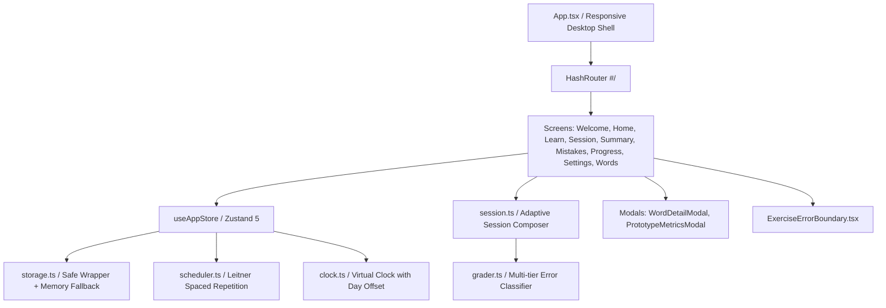
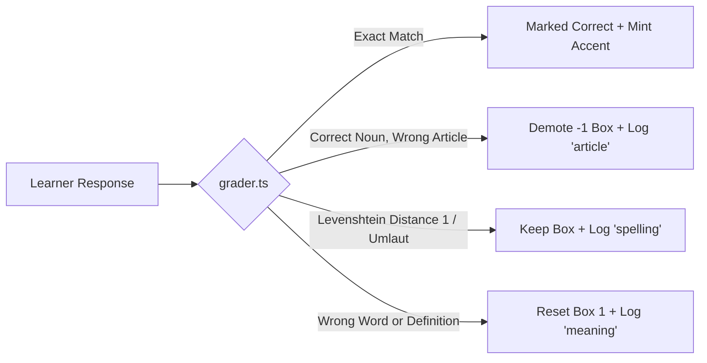

# Final Project Report: Station Deutsch

> **Medical German Vocabulary Practice for Indian Nurses (A1 / A2)**  
> **Repository:** [https://github.com/Akshay-2441505/Station_Deutsch](https://github.com/Akshay-2441505/Station_Deutsch)  
> **Status:** Production Ready · 127/127 Tests Passing · Zero Dependency Overhead  
> **Date:** October 2026

---

## 1. Executive Summary

**Station Deutsch** is a dedicated, mobile-first web application engineered specifically for Indian nurses training to work in German hospitals and elderly care facilities.

### The Problem
Healthcare German training involves rigorous live classroom sessions (such as those led by Skillcase and specialized language institutes). However, nursing candidates face a severe retention drop-off between lessons:
- Complex medical compound nouns (*das Blutdruckmessgerät*, *die Dokumentationsmappe*) are overwhelming to memorize without repetitive exposure.
- German noun genders (*der*, *die*, *das*) follow no intuitive English equivalents, yet wrong genders lead to severe case-inflection errors in clinical charts.
- General language apps (e.g., Duolingo) focus on non-clinical travel phrases (*"The cat drinks milk"*), while dense textbooks are impractical during 3–5 minute hospital shift breaks.

### The Solution
Station Deutsch acts as a low-friction between-class practice companion:
- **Zero Sign-Up Barrier**: Nurses start practicing immediately with zero login, password, or account setup.
- **Bite-Sized Clinical Micro-Sessions**: Fixed at 10 items (completable in under 3 minutes).
- **Leitner Spaced Repetition Engine**: Pure, deterministic 5-box spaced retrieval with daily promotion caps and aggressive demotions for persistent errors.
- **Targeted Hospital Vocabulary**: 70 carefully curated clinical words across 5 core topics (Body, Symptoms, Ward, Care, Patient Admission), balanced between foundational A1 and contextual A2.
- **Word Bank Reference & Search (`#/words`)**: Grouped, searchable, and filterable dictionary of all curriculum words with instant single-word practice drills.
- **Transparent Mistake Audit Ledger (`#/mistakes`)**: Logs target words, given vs. expected answers, error types (*article*, *spelling*, *meaning*), and resolution status.
- **Privacy-First Metrics & GTM Touches**: Zero personal data collection, local-only prototype analytics, WhatsApp study-partner invites, and demo trainer links.

```
Quick Check (or Manual Choice) ──► Topic Map (Home) ──► Learn Batch (5–8 words)
               ▲                            │                     │
               │                            ▼                     ▼
      Simulate Tomorrow              Practise Session (10 items) ◄┘
         (Virtual Clock)                    │
               ▲                            ▼
               │                     Instant Feedback + Retry Queue
               │                            │
               └──────── Session Summary ◄──┘
                    (Accuracy Trend + Next Review)
```

---

## 2. Software Architecture & Technology Stack

The project adheres strictly to modern web standards, lightweight performance constraints, and zero heavy styling dependencies.



### Core Technologies
| Component | Technology | Rationale |
|---|---|---|
| **Runtime & Bundler** | Vite 6 + React 18 | Instant HMR, minimal production bundle size (~83 kB gzip). |
| **Language** | TypeScript (Strict mode) | Complete type safety across scheduler models, exercise variants, metrics, and attempts. |
| **Styling** | Vanilla CSS (`index.css`) | Curated design tokens, CSS Grid, custom cubic-bezier animations, dark mode palettes, zero Tailwind overhead. |
| **State Management** | Zustand 5 with custom persistence | Fast, predictable state management with versioned schema migrations (`station-deutsch:v2`). |
| **Routing** | React Router 6 (`HashRouter`) | Hash-based routing (`#/`) guarantees reliable client-side navigation on static hosts (Vercel, GitHub Pages) without server rewrite issues. |
| **Typography** | `@fontsource-variable/fraunces` & `figtree` | Self-hosted Google Fonts: Fraunces (editorial serif for German prompts and score numerals) and Figtree (clean sans-serif for UI and English glosses). |
| **Icons** | `lucide-react` | Lightweight, accessible SVG icons with zero runtime footprint. |

### Desktop Presentation Architecture ($\ge 1024$px)
While designed mobile-first for physical Android smartphones ($390$px base width), desktop evaluators experience a dedicated two-column layout:
- **Left Column**: Text wordmark, honest product description, a 3-step evaluator guide, and prototype metadata.
- **Right Column**: An authentic $390 \times \min(820\text{px}, 100\text{dvh} - 48\text{px})$ mobile frame with rounded corners, subtle drop shadow, and hidden inner scrollbars (`scrollbar-width: none`).
- **Dynamic Background Synchronization**: Outer device frame dynamically matches the active screen background via CSS `:has()` rules (`.screen--black`, `.screen--lemon`, `.screen--mint`), eliminating boundary artifacts.

---

## 3. Spaced Repetition & Pedagogical Engine

The learning engine is implemented as pure, deterministic TypeScript functions in `src/lib/scheduler.ts` and `src/lib/grader.ts`:

### 3.1 Leitner 5-Box Interval Schedule
| Box | State Label | Interval | Criteria to Reach |
|---|---|---|---|
| **Box 0** | New | Immediate | Initial unpracticed state. |
| **Box 1** | Learning | Immediate | First answered check moves word here regardless of score. |
| **Box 2** | Familiar | 1 day | 1 correct answer on a subsequent calendar day. |
| **Box 3** | Familiar | 3 days | Correct answer when due from Box 2. |
| **Box 4** | Strong | 7 days | Correct answer when due from Box 3. |
| **Box 5** | Mastered | 14 days | Correct answer when due from Box 4. Mastered words never retire—they return every 14 days for long-term retention. |

### 3.2 Strict Daily Promotion Cap
To prevent cramming in a single sitting, **a word can only be promoted to a higher box once per calendar day** (tracked via `lastPromotedDay: 'YYYY-MM-DD'`). Subsequent correct answers within the same day reinforce memory without artificially inflating Leitner progress.

### 3.3 Demotion & Stubborn Word Rules
- **Article Mistake**: Choosing or typing the correct noun with the wrong gender demotes the word by **$-1$ box** (minimum Box 1) and logs an `article` error.
- **Spelling Near-Miss**: Edit distance of 1 or umlaut substitution (e.g. `ae` for `ä`) logs a `spelling` error with corrective feedback, but does **not demote** the word.
- **Meaning / Word Error**: Selecting the wrong word or typing an incorrect translation resets the word directly to **Box 1**.
- **Stubborn Flag**: Any word missed twice in its last 5 attempts is flagged `stubborn: true`.
- **Stubborn Cap**: A stubborn word **cannot advance past Box 2** until it clears with **3 consecutive correct answers**. It is also forced into recognition exercises and prioritized in remediation drills.

---

## 4. Exercise Types & Error Classification



### Exercise Formats
1. **Multiple Choice (DE $\rightarrow$ EN)**: Tests German-to-English recognition. Distractors are dynamically matched by topic and part of speech.
2. **Multiple Choice (EN $\rightarrow$ DE with article)**: English prompt with 4 German options: 1 correct noun with article, 1 same noun with an incorrect article (tests gender retention), and 2 same-topic distractor nouns.
3. **Article Drill**: Noun presented alone; learner taps `der`, `die`, or `das`.
4. **Fill in the Blank**: Clinical ward sentence with a blank gap. Tests the target word in hospital context.
5. **Typed Recall**: Learner types the German headword and selects the article. Includes soft keyboard buttons for German characters: `ä`, `ö`, `ü`, `ß`.
6. **Match Pairs**: 4 German-English clinical pairs displayed as independent tiles with separate column shuffling. Slips are tracked per word, and advancing requires a user-driven "Continue" confirmation.

### Fixed Denominator & Immediate Retries
- Standard practice sessions maintain a **fixed total denominator** (e.g. 10 items). Retries never cause the counter to overflow (preventing bugs like `11 of 10`).
- Missed words are automatically re-queued **2 to 4 items later** in the same session, displaying a distinct coral **"Retry"** badge.

### Distractor Integrity Engine
Distractors are strictly filtered in `src/lib/session.ts` via:
- **`sharesContentWord`**: Discards distractors that share English content roots (e.g. preventing *"back pain"* from appearing as a distractor for *"pain"*).
- **`conflicts`**: Custom exclusion blacklist defined on vocabulary entries.
- **POS Matching**: Verbs distract verbs; nouns distract nouns.

---

## 5. Vocabulary Curriculum & Content Status

The active curriculum contains **70 medical German entries** across 5 clinical topics, maintaining an intentional balance between foundational A1 vocabulary and contextual A2 vocabulary:

```
Total Active Bank: 70 words
├── A1 Level: 45 words (Foundational clinical nouns, verbs, symptoms)
└── A2 Level: 25 words (Procedures, admission records, compound symptoms)
```

### Breakdown by Clinical Topic
| Topic | Total | A1 Count | A2 Count | Representative Vocabulary |
|---|---|---|---|---|
| **`body`** | 15 | 11 | 4 | *der Kopf, das Herz, der Magen, der Knochen, die Wirbelsäule* |
| **`symptoms`** | 17 | 10 | 7 | *das Fieber, die Schmerzen, die Übelkeit, die Atemnot, der Schüttelfrost* |
| **`care`** | 16 | 11 | 5 | *waschen, messen, pflegen, der Verbandwechsel, der Katheter, bettlägerig* |
| **`ward`** | 11 | 7 | 4 | *das Bett, das Zimmer, die Station, die Spritze, das Thermometer* |
| **`patient`** | 11 | 6 | 5 | *der Name, das Alter, das Geburtsdatum, die Versicherung, die Dokumentation* |
| **Total** | **70** | **45** | **25** | Every topic contains $\ge 4$ words at both levels for valid distractors. |

### Verification Status & Worksheet
- In compliance with content honesty rules, all 70 active words and 8 placement items are flagged with `"verification": { "status": "unverified", "sources": [] }`.
- **Automated Validation**:
  - `npm run validate:content`: Checks uniqueness, sentence completeness, umlaut spelling, and distractor coverage. (Passes with 0 errors).
  - `npm run validate:strict`: Enforces that all items have verified human sources before production deployment.
- **Worksheet Generator**: `npm run content:worksheet` writes `content/verification-worksheet.md` with direct search links to Wiktionary and Duden for human review.

---

## 6. Key Screens & Features

| Feature / Screen | Route | Description |
|---|---|---|
| **Welcome Screen** | `#/welcome` | Quick placement check (8 questions) or manual level selection. Includes configurable value-proposition subheadline (`copy.ts`). |
| **Home Dashboard** | `#/` | Daily goal tracking with honest cap display (*"Goal reached · N answers today"*), 5 visual topic cards, and top weak-words summary. |
| **Word Bank** | `#/words` | Complete searchable curriculum directory grouped by topic, filtered by level (All, A1, A2) and Leitner state, with "Hide meanings" flashcard mode and single-word drill modals. |
| **Learn Batch** | `#/learn-preview` | Bite-sized introduction of 5–8 unseen words with audio pronunciation, gender color-coding, clinical example sentences, and tips. |
| **Practice Session** | `#/learn` | 10-item adaptive session featuring 6 exercise formats, immediate feedback, and retry queues. |
| **Session Summary** | `#/summary` | Accuracy percentage, breakdown of correct vs. retried answers, comparison with previous session (*"Last session 60%, today 80%"*), next review horizon, and dismissible demo trainer CTA. |
| **My Mistakes Ledger** | `#/mistakes` | Chronological error audit log with given vs. expected answers, error taxonomy chips (*article*, *spelling*, *meaning*), and dedicated *"Practise these"* button. |
| **Progress Matrix** | `#/progress` | Full Leitner 5-box breakdown, error category distribution, stubborn words watchlist, and WhatsApp weak-words sharing. |
| **Settings & Demo Tools** | `#/settings` | Audio speed controls, level switcher, WhatsApp partner invite, offline JSON export/restore, virtual clock simulator (*"Simulate tomorrow"*), and Prototype Metrics. |

---

## 7. GTM, Privacy & Prototype Telemetry

1. **Configurable Headlines (`src/content/copy.ts`)**:
   - Benefit subheadline stored in constants so marketing owners can adjust messaging without touching code components.
2. **Attribution UTM Builder (`src/lib/utm.ts`)**:
   - Appends `utm_source=station_deutsch&utm_medium=prototype&utm_campaign=<placement>` to external links.
   - Quiet, dismissible "Practise live with a trainer: free demo" CTA displayed on the Summary screen and when all words at the current level have been seen (hidden when `SKILLCASE_DEMO_URL` is empty).
3. **WhatsApp Organic Virality**:
   - "Invite a study partner" link in Settings and Summary generates pre-composed WhatsApp messages linking to the app.
   - "Send my weak words on WhatsApp" enables quick check-ins with language mentors or study buddies.
4. **Privacy-First Prototype Metrics (`src/lib/gtm_metrics.ts`)**:
   - Computes local KPIs entirely on-device from `localStorage`:
     - Sessions completed
     - Total answers given
     - First-try accuracy percentage
     - Total calendar days practiced
     - Retry success rate
   - Zero personal data, cookies, or identifiers collected.
   - Dev-only typed `track(event, props)` logs to console during development and no-ops in production.

---

## 8. Quality, Accessibility & UI Resilience

### Accessibility & Contrast Standards
- **Color Contrast Tested (WCAG 2.1 AAA / AA)**:
  - Slate Black (`#0F172A`) on Lemon (`#E8FF8C`): **16.0 : 1** (exceeds AAA 7:1)
  - Slate Black (`#0F172A`) on Mint (`#85E874`): **10.95 : 1** (exceeds AAA 7:1)
  - Slate Black (`#0F172A`) on White (`#FFFFFF`): **17.2 : 1** (exceeds AAA 7:1)
  - Dark Gray (`#475569`) on White (`#FFFFFF`): **7.55 : 1** (exceeds AA 4.5:1)
- **Visual Redundancy**: All feedback pairs color with icons (`Check` / `X`) for colorblind usability.
- **200% Font Scaling**: Dynamic button heights with `min-height: 56px; height: auto` prevent text truncation.

### UI Alignment & Layout Architecture
- **No White Frame Leakage**: Outer `.desktop-device-frame` reacts to child screen backgrounds via `:has()` rules.
- **Viewport-Anchored Bottom Sheets**: All modal overlays (`WordDetailModal`, `PrototypeMetricsModal`) are rendered inside fixed-height screen shells with internal `.content` scrolling, ensuring that modals dock flush to the bottom edge regardless of scroll position.
- **Storage Degradation**: If `localStorage` is disabled or blocked in private browsing, `src/lib/storage.ts` transitions seamlessly to an in-memory map without crashing, displaying a non-intrusive warning banner.
- **Speech Synthesis Guard**: If the browser lacks speech synthesis or if no German voice is installed on the device, the audio button degrades gracefully without throwing.
- **Exercise Error Boundary**: Every practice item is wrapped in an `ExerciseErrorBoundary` with a *"Skip to next"* fallback, guaranteeing that an isolated rendering bug never freezes an entire session.

---

## 9. Test Suite & Verification Results

The automated test suite covers all business logic, algorithms, UI components, content hygiene, and telemetry:

```bash
$ npm test

 RUN  v2.1.9 C:/Users/aakur/OneDrive/Desktop/Skillcase

 ✓ src/tests/grader.test.ts (24 tests)
 ✓ src/tests/match_exercise.test.ts (2 tests)
 ✓ src/tests/placement.test.ts (4 tests)
 ✓ src/tests/gtm_metrics.test.ts (12 tests)
 ✓ src/tests/scheduler.test.ts (27 tests)
 ✓ src/tests/content_hygiene.test.ts (7 tests)
 ✓ src/tests/phase1_bugs.test.ts (6 tests)
 ✓ src/tests/phase4_quality.test.ts (14 tests)
 ✓ src/tests/session.test.ts (15 tests)
 ✓ src/tests/phase3_features.test.ts (8 tests)
 ✓ src/tests/word_bank.test.ts (7 tests)
 ✓ src/tests/phase2_visual.test.ts (1 test)

 Test Files  12 passed (12)
      Tests  127 passed (127)
   Duration  1.83s
```

Production build validation:
```bash
$ npm run build
✓ 1624 modules transformed.
dist/index.html                     0.60 kB │ gzip:  0.37 kB
dist/assets/index-B-tG8ZI8.css     13.54 kB │ gzip:  3.25 kB
dist/assets/index-f8BqLpjT.js     284.30 kB │ gzip: 83.49 kB
✓ built in 14.90s
```

---

## 10. Repository Status & Owner Next Steps

- **GitHub Repository**: [https://github.com/Akshay-2441505/Station_Deutsch](https://github.com/Akshay-2441505/Station_Deutsch)
- **Branch**: `master` (All commits pushed cleanly up to `491c9e3`).

### Actionable Next Steps for Project Owner:
1. **Human Verification**: Review `content/verification-worksheet.md` against official Goethe-Institut / Duden medical references and flip `verification.status` to `"verified"`.
2. **Vercel / Static Hosting**: Connect the GitHub repository to Vercel (pre-configured with `vercel.json` for instant deployment).
3. **Set Demo Link**: When ready, set `SKILLCASE_DEMO_URL` in `src/content/copy.ts` with your live trainer booking page.
